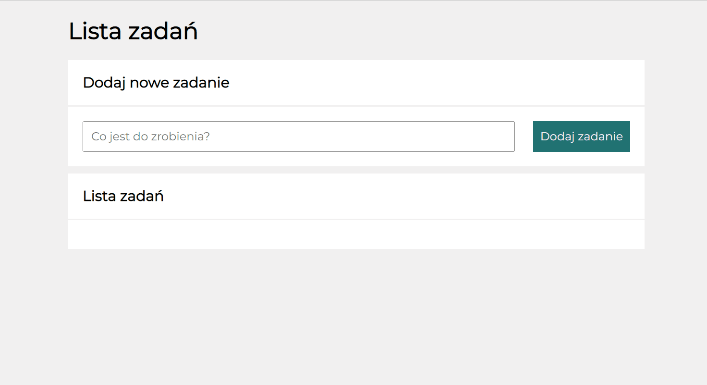

# To do list

## Demo

https://magdawicik.github.io/to-do-list/

## Description

On this website you can create a task list. It is possible to mark a task as done and then delete it. There are also two buttons - with one of them you can hide completed tasks and with the other you can mark all tasks as completed

## Used features

HTML, CSS, JavaScript (ES6+), BEM convention, Git
